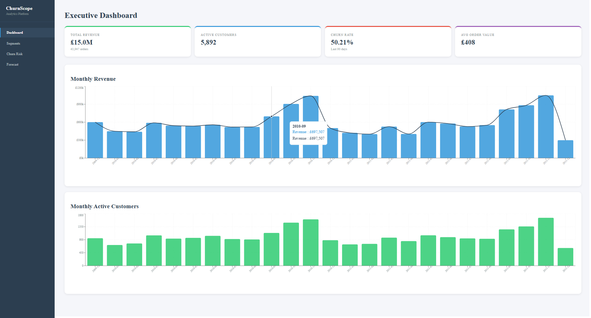

# ChurnScope — Customer Churn Prediction & Revenue Analytics Platform

An end-to-end data science platform that answers four business questions for an e-commerce company: *How is the business doing? Who are our customers? Who is about to leave? Where is revenue heading?*

Built with real transactional data (UCI Online Retail II, ~1M rows), covering the full pipeline from raw data to deployed dashboard.



---

## Business Problem

An e-commerce company is losing customers and doesn't know why. Leadership needs to understand: who is churning, why, when they're likely to churn, and what the revenue impact is. They also want demand forecasting to plan inventory.

## Key Results

| Metric | Result |
|--------|--------|
| Churn Model AUC-ROC | **0.92** (Random Forest) |
| Churn Precision/Recall | 83.1% / 84.1% at default threshold |
| Forecast MAPE | **13.6%** (ARIMA) |
| Revenue at Risk | £2.8M from At-Risk Big Spenders segment |
| Customer Segments | 4 actionable groups via RFM + K-Means |
| Data Pipeline | 1M+ rows cleaned and loaded in <45s |

## Architecture

```
┌─────────────┐     ┌──────────────┐     ┌──────────────┐
│  UCI Excel   │────▶│  ETL Pipeline │────▶│  PostgreSQL   │
│  (1M rows)   │     │  (Python)     │     │  Star Schema  │
└─────────────┘     └──────────────┘     └──────┬───────┘
                                                 │
                    ┌────────────────────────────┤
                    │                            │
              ┌─────▼──────┐              ┌─────▼──────┐
              │  ML Models  │              │  FastAPI    │
              │  - Churn    │              │  REST API   │
              │  - RFM/K-Means│            └─────┬──────┘
              │  - ARIMA    │                    │
              └─────┬──────┘              ┌─────▼──────┐
                    │                     │  React +    │
                    └────────────────────▶│  TypeScript │
                                          │  Dashboard  │
                                          └────────────┘
```

## Tech Stack

| Layer | Technology |
|-------|-----------|
| Data Processing | Python, Pandas, NumPy |
| Database | PostgreSQL 16 (star schema) |
| ETL Pipeline | Python (Extract → Clean → Transform → Load) |
| ML — Classification | Scikit-learn (Logistic Regression, Random Forest, XGBoost) |
| ML — Clustering | K-Means with RFM scoring |
| ML — Time Series | ARIMA, SARIMA, Prophet |
| Backend API | FastAPI |
| Frontend | React + TypeScript + Recharts |
| Deployment | Docker Compose |

## Dashboard Pages

### Executive Dashboard
KPI cards (total revenue, active customers, churn rate, avg order value) with monthly revenue and active customer trends.

### Customer Segments
Four segments identified via RFM analysis + K-Means clustering:
- **Champions** (1,108 customers) — high frequency, high spend, very recent. Protect at all costs.
- **Promising New** (1,233) — recent but few purchases. Nurture with onboarding.
- **At-Risk Big Spenders** (1,471) — historically valuable but going dormant (~207 days). Highest-ROI retention target.
- **Lost Low-Value** (2,049) — single-purchase, long gone. Low reactivation priority.

### Churn Risk
Feature importance chart, model performance KPIs, and paginated table of at-risk customers with probability scores, risk tiers, and filtering.

### Revenue Forecast
6-month ARIMA forecast with confidence intervals, historical trend line, and forecast detail table.

## Data Pipeline

**Source:** UCI Online Retail II dataset — real UK e-commerce transactions (Dec 2009 – Dec 2011).

**ETL Steps:**
1. Extract: Read two Excel sheets, concatenate, validate columns
2. Clean: Dedup sheet overlap (34K rows), filter non-products (5.6K), remove invalid prices (6K), cap outlier quantities
3. Transform: Build star schema — dim_dates, dim_products, dim_customers (with synthetic demographics), fact_transactions
4. Load: TRUNCATE + INSERT to PostgreSQL with referential integrity validation
5. Validate: 8 automated checks (row counts, FK integrity, null checks)

**Result:** 1,067,371 → 794,222 fact rows across 5,894 customers and 4,905 products.

## Model Details

### Churn Prediction
- **Definition:** No purchase in last 90 days relative to dataset end date
- **Features:** tenure_days, frequency, monetary, avg_order_value, return_rate, purchase_trend, avg_items_per_order, region, acquisition_channel, age_group
- **Data leakage caught and fixed:** Recency (which directly encodes the churn label) was excluded from features
- **Threshold optimization:** At threshold 0.2, recall reaches 97.8% — the expected value framework shows this minimizes total business cost

### Demand Forecasting
- **Walk-forward validation** (not random split) — respects temporal ordering
- **ARIMA(1,1,1)** wins at 13.6% MAPE
- **SARIMA underperformed** (27.5% MAPE) — insufficient seasonal cycles in 24-month series
- **Prophet underperformed** (59.3% MAPE) — designed for longer daily series

## Quick Start

### Prerequisites
- Docker and Docker Compose
- The UCI Online Retail II dataset (place as `data/online_retail_II.xlsx`)

### Run with Docker Compose

```bash
# Clone and enter the project
git clone https://github.com/yourusername/churnscope.git
cd churnscope

# Place the dataset
# Download from: https://archive.ics.uci.edu/dataset/502/online+retail+ii
# Save as: data/online_retail_II.xlsx

# Start all services
docker compose up --build -d

# Run the ETL pipeline (first time only)
docker compose exec backend python -m backend.etl.pipeline

# Run the analysis pipeline (first time only)
docker compose exec backend python -m backend.analysis.eda
docker compose exec backend python -m backend.analysis.clustering
docker compose exec backend python -m backend.analysis.churn_model
docker compose exec backend python -m backend.analysis.forecasting

# Open the dashboard
# http://localhost:3000
```

### Run Locally (Development)

```bash
# Start PostgreSQL
docker start churnscope-db  # or create with docker run (see docs)

# Backend
conda activate churnscope
pip install -r backend/requirements.txt
python -m backend.etl.pipeline
python -m backend.analysis.eda
python -m backend.analysis.clustering
python -m backend.analysis.churn_model
python -m backend.analysis.forecasting
uvicorn backend.app.main:app --host 0.0.0.0 --port 8001 --reload

# Frontend (separate terminal)
cd frontend
npm install
npm run dev
# Open http://localhost:5173
```

## Project Structure

```
churnscope/
├── docker-compose.yml
├── backend/
│   ├── Dockerfile
│   ├── requirements.txt
│   ├── app/                    # FastAPI application
│   │   ├── main.py
│   │   ├── config.py
│   │   ├── database.py
│   │   ├── schemas.py
│   │   └── routers/
│   │       ├── kpis.py
│   │       ├── segments.py
│   │       ├── churn.py
│   │       └── forecast.py
│   ├── etl/                    # ETL pipeline
│   │   ├── config.py
│   │   ├── extract.py
│   │   ├── clean.py
│   │   ├── transform.py
│   │   ├── load.py
│   │   └── pipeline.py
│   ├── analysis/               # ML and analytics
│   │   ├── eda.py
│   │   ├── rfm.py
│   │   ├── clustering.py
│   │   ├── churn_model.py
│   │   └── forecasting.py
│   └── sql/                    # Standalone SQL queries
│       ├── schema.sql
│       ├── rfm_scores.sql
│       ├── revenue_trends.sql
│       ├── cohort_retention.sql
│       ├── pareto_analysis.sql
│       └── customer_ltv.sql
├── frontend/
│   ├── Dockerfile
│   ├── src/
│   │   ├── App.tsx
│   │   ├── api/client.ts
│   │   ├── types/index.ts
│   │   ├── pages/
│   │   │   ├── Dashboard.tsx
│   │   │   ├── Segments.tsx
│   │   │   ├── ChurnRisk.tsx
│   │   │   └── Forecast.tsx
│   │   └── components/
│   │       └── KPICard.tsx
│   └── public/
├── notebooks/
│   └── learning_log.md
└── reports/                    # Generated outputs
    ├── eda/
    ├── segmentation/
    ├── churn/
    └── forecast/
```

## Resume Bullets

- Identified £2.8M in at-risk revenue by building an end-to-end churn prediction pipeline (Random Forest, AUC 0.92) with RFM customer segmentation on 1M+ e-commerce transactions, deployed as a React/TypeScript analytics dashboard.
- Engineered a star-schema ETL pipeline ingesting multi-source retail data into PostgreSQL, with automated cleaning, transformation, and validation powering predictive and time-series models.
- Forecasted 6-month revenue within ±13.6% MAPE by comparing ARIMA, SARIMA, and Prophet models with walk-forward validation, enabling data-driven inventory and budget planning.

## License

Dataset: [UCI Online Retail II](https://archive.ics.uci.edu/dataset/502/online+retail+ii) — CC BY 4.0